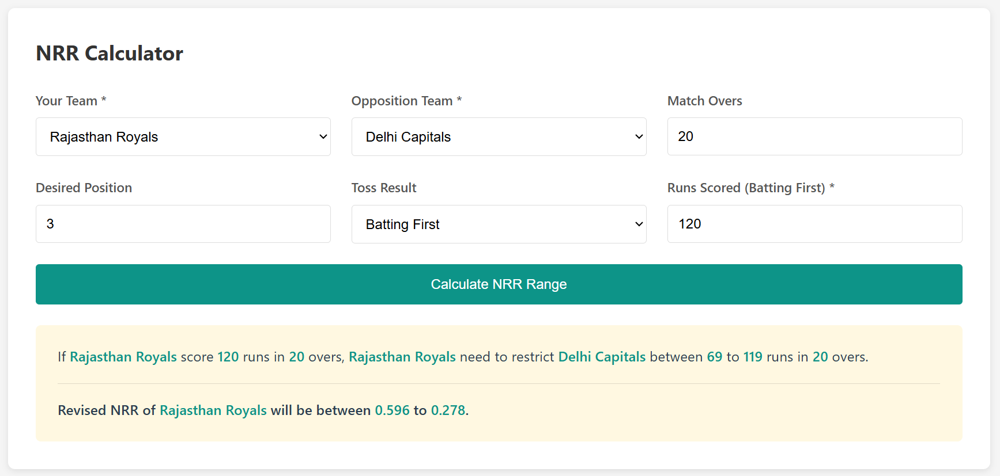
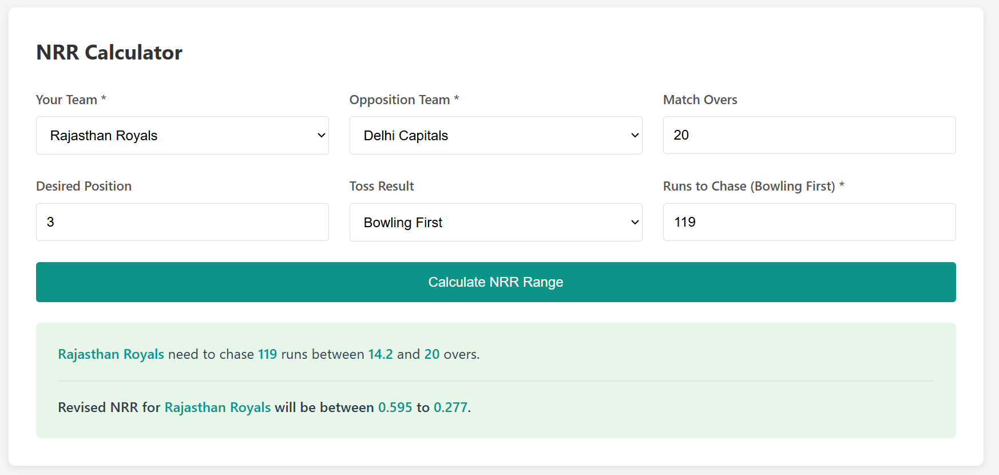
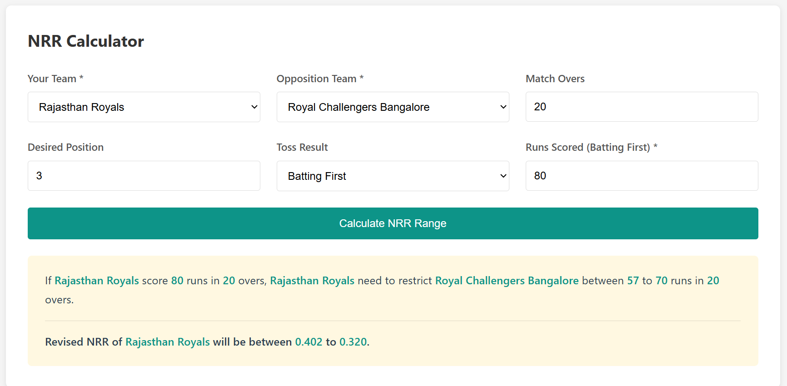
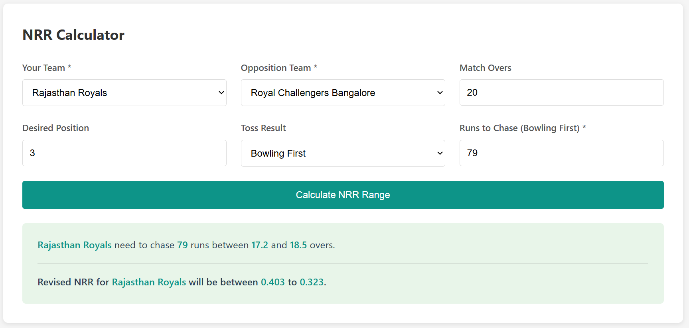
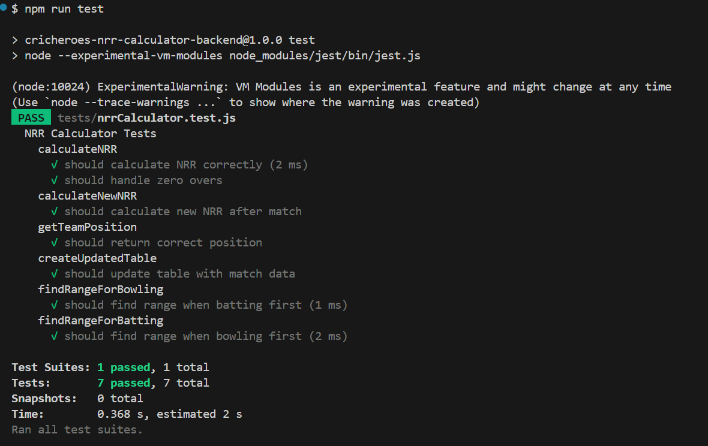
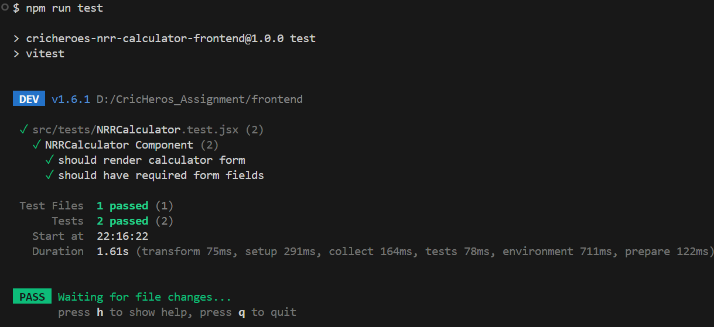

# IPL NRR Calculator - CricHeroes Assignment

A full-stack application that helps IPL teams calculate the performance (runs/overs) they need in their next match to reach a desired position in the points table using Net Run Rate (NRR) calculations.

## Project Structure

```
CricHeros_Assignment/
├── backend/          # Node.js + Express backend
│   ├── controllers/  # Request handlers
│   ├── routes/       # API routes
│   ├── utils/        # NRR calculation logic
│   ├── data/         # Static points table data (JavaScript objects)
│   └── tests/        # Backend tests
├── frontend/         # React + Vite frontend
│   ├── src/
│   │   ├── components/  # React components
│   │   ├── services/    # API service layer
│   │   ├── styles/      # CSS files
│   │   └── tests/       # Frontend tests
└── README.md
```

## Tech Stack

### Backend
- Node.js with Express
- ES6 Modules
- Jest for testing
- Static data storage (JavaScript objects/arrays, no database)

### Frontend
- React 18
- Vite
- Axios for API calls
- Plain CSS (no external UI libraries)
- Vitest for testing

## Prerequisites

- Node.js (v16 or higher)
- npm or yarn

## Installation & Setup

### Backend Setup

1. Navigate to the backend directory:
```bash
cd backend
```

2. Install dependencies:
```bash
npm install
```

3. Start the server:
```bash
npm start
```

For development with auto-reload:
```bash
npm run dev
```

The backend server will run on `http://localhost:3001`

### Frontend Setup

1. Navigate to the frontend directory:
```bash
cd frontend
```

2. Install dependencies:
```bash
npm install
```

3. Start the development server:
```bash
npm run dev
```

The frontend will run on `http://localhost:3000`

## Deployment

The application is deployed on Vercel:

- **Frontend**: [https://cricheros.urvish.website/](https://cricheros.urvish.website/)
- **Backend API**: [https://cricheros-backend.urvish.website/](https://cricheros-backend.urvish.website/)

You can access the live application using the frontend link above.

## Running Tests

### Backend Tests

From the `backend` directory:
```bash
npm test
```

### Frontend Tests

From the `frontend` directory:
```bash
npm test
```

## API Endpoints

### GET `/api/nrr/points-table`
Returns the current IPL points table.

**Response:**
```json
{
  "success": true,
  "data": [
    {
      "team": "Chennai Super Kings",
      "matches": 7,
      "won": 5,
      "lost": 2,
      "nrr": 0.771,
      "runsFor": 1130,
      "oversFor": 133.1,
      "runsAgainst": 1071,
      "oversAgainst": 138.5,
      "points": 10
    },
    ...
  ]
}
```

### POST `/api/nrr/calculate`
Calculates the NRR range required to reach a desired position.

**Request Body:**
```json
{
  "yourTeam": "Rajasthan Royals",
  "oppositionTeam": "Delhi Capitals",
  "matchOvers": 20,
  "desiredPosition": 3,
  "tossResult": "batting",
  "runs": 120
}
```

**Response (Batting First):**
```json
{
  "success": true,
  "data": {
    "scenario": "batting_first",
    "yourTeam": "Rajasthan Royals",
    "oppositionTeam": "Delhi Capitals",
    "runsScored": 120,
    "oversBatted": 20,
    "minRunsToRestrict": 0,
    "maxRunsToRestrict": 119,
    "oversToRestrict": 20,
    "minNRR": 0.331,
    "maxNRR": 0.450
  }
}
```

**Response (Bowling First):**
```json
{
  "success": true,
  "data": {
    "scenario": "bowling_first",
    "yourTeam": "Rajasthan Royals",
    "oppositionTeam": "Delhi Capitals",
    "runsToChase": 119,
    "runsConceded": 119,
    "oversBowled": 20,
    "minOversToChase": 0.1,
    "maxOversToChase": 20.0,
    "minNRR": 0.331,
    "maxNRR": 0.450
  }
}
```

## Features

1. **Points Table Display**: View current IPL points table with all team statistics
   - Color-coded NRR values (green for positive, red for negative)
2. **NRR Calculation**: Calculate the range of runs/overs needed to reach desired position
   - **Important**: Team must finish exactly at the desired position, not higher
3. **Two Scenarios**:
   - **Batting First**: Calculate how many runs to restrict opponent to
   - **Bowling First**: Calculate overs range to chase target in
4. **Dynamic Range Calculation**: Uses iterative approach to find valid ranges dynamically
5. **Cricket Format Handling**: Properly handles cricket overs format (e.g., 18.5 overs = 18 overs + 5 balls)
6. **Real-time Results**: Instant calculation with formatted output


## How NRR Calculation Works

Net Run Rate (NRR) is calculated as:
```
NRR = (Total Runs Scored / Total Overs Faced) - (Total Runs Conceded / Total Overs Bowled)
```

**Important Constraint**: The team must finish exactly at the desired position, not higher. For example, if the desired position is 3rd, the team must finish at position 3, not position 2 or 1.

The application:
1. Takes current points table data
2. Simulates the match with different scenarios (runs/overs)
3. Recalculates NRR for all teams after the match
4. Checks if the team finishes exactly at the desired position (not higher)
5. Returns the range of valid values that achieve the exact desired position
6. Handles cricket overs format correctly (e.g., 18.5 = 18 overs + 5 balls, not 18.8)

## Code Structure

- **Modular Design**: Separated routes, controllers, and utilities
- **Arrow Functions**: Consistent use of ES6 arrow functions throughout
- **Clean Code**: Well-commented, human-readable code
- **Error Handling**: Comprehensive error handling and validation
- **Testing**: Unit tests for critical calculation functions
- **Cricket Format**: Proper handling of overs format (whole overs + balls 0-5)
- **Position Constraint**: Enforces exact position requirement (not higher than desired)

## Notes

- No database is used - all data is stored as static JavaScript objects/arrays
- No external UI libraries - only React and plain CSS
- Calculations are done dynamically - no hardcoded values
- Test cases are included for both backend and frontend
- Team must finish exactly at desired position (not higher)
- Proper cricket overs format handling (e.g., 18.5 overs, not 18.8)

## Screenshots

### Test Case Results

#### Case 1: Rajasthan Royals vs Delhi Capitals (Want 3rd Position)

**Case 1a - Batting First:**


**Case 1b - Bowling First:**


#### Case 2: Rajasthan Royals vs Royal Challengers Bangalore (Want 3rd Position)

**Case 2a - Batting First:**


**Case 2b - Bowling First:**


### Testing Library Results

**Backend Tests (Jest):**


**Frontend Tests (Vitest):**


## Submission Checklist

- ✅ All features implemented as per assignment requirements
- ✅ Code follows best practices with clean, modular structure
- ✅ Proper error handling and validation
- ✅ Screenshots added to README
- ✅ No database use
- ✅ No UI dependencies outside React.js

---

**Built for CricHeroes Full Stack Developer Assignment**

